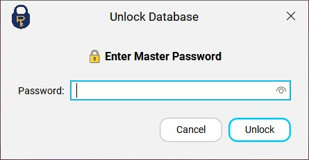

<div align="center">
  <a href="https://github.com/Spike271/MiniPass" target="_blank">
    
  </a>  
</div>

<h1 align="center">MiniPass</h1>

<div align="center">

[](https://github.com/Spike271/MiniPass/actions/workflows/maven.yml)

</div>

## Description
MiniPass is a robust desktop-based password manager developed using Java Swing. It
focuses on providing a clean, efficient interface for storing and managing sensitive
credentials locally. Designed with a "utility-first" mindset, MiniPass ensures that your
passwords are readily accessible while maintaining visual privacy through specialized UI
components.

## Screenshots

<div align="center">


")
")

</div>

## Installation

### Requirements

- Make sure you have JDK 22 or the above version installed on your local machine.

To run the app

* Go to the GitHub releases section [GitHub Releases](https://github.com/Spike271/MiniPass/releases)

* Grab the zip for your platform, extract it.

* For windows just double-click on the jar file to run it. Or you can use the command which is given below.

```bash
  java -jar "minipass-1.0.jar"
```

